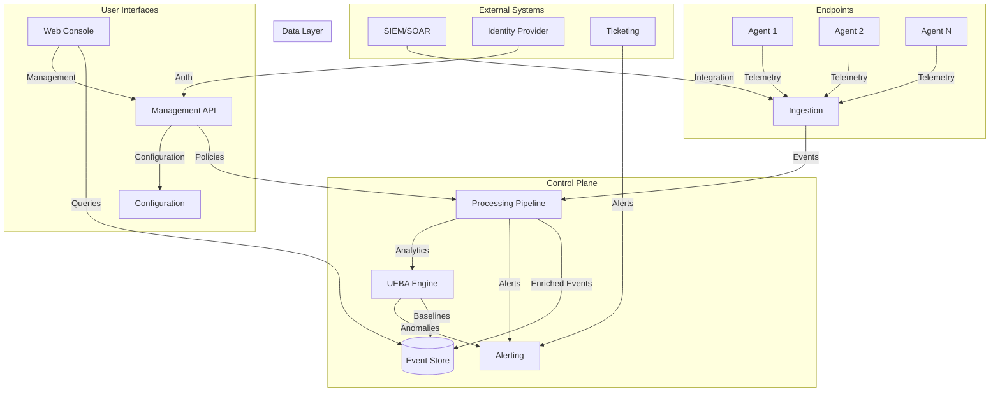

# INSEC Architecture

This document provides a comprehensive overview of INSEC's system architecture, design principles, and component interactions.

## 🏗️ System Overview

INSEC is a distributed, privacy-respectful enterprise insider-threat detection and response platform built with a microservices architecture.



## 🏛️ Core Principles

### Privacy-First Design
- **Data Minimization**: Collect only necessary telemetry
- **Purpose Limitation**: Data used only for security purposes
- **Retention Controls**: Configurable data retention policies
- **Consent Management**: User consent for sensitive data collection

### Security by Design
- **Zero Trust**: Every component verifies identity and authorization
- **Defense in Depth**: Multiple security layers and controls
- **Secure Defaults**: Security features enabled by default
- **Audit Everything**: Comprehensive audit logging

### Scalability & Performance
- **Horizontal Scaling**: Components scale independently
- **Event-Driven**: Asynchronous processing for high throughput
- **Caching**: Intelligent caching for performance optimization
- **Load Balancing**: Distributed load across multiple instances

## 📦 Component Architecture

### 1. Endpoint Agent (Rust)

**Purpose**: Collect telemetry from endpoints and enforce local policies

**Key Features**:
- Cross-platform support (Windows, macOS, Linux)
- Low resource footprint (<2% CPU, <200MB RAM)
- Real-time event collection
- Local policy enforcement
- Offline queue and cache
- Self-protection mechanisms

**Architecture**:
```
┌─────────────────┐
│   Agent Core    │
├─────────────────┤
│ Event Collectors│
│ - Process       │
│ - File System   │
│ - Network       │
│ - User Activity │
├─────────────────┤
│ Policy Engine   │
├─────────────────┤
│ Communication   │
│ - mTLS          │
│ - Queue         │
│ - Compression   │
└─────────────────┘
```

### 2. Control Plane (Go)

**Purpose**: Process events, manage policies, and provide APIs

**Key Features**:
- Multi-tenant architecture
- RESTful APIs
- Event processing pipeline
- Policy management
- User authentication and authorization
- Integration with external systems

**Microservices**:
- **Ingestion Service**: Event intake and validation
- **Processing Service**: Event enrichment and correlation
- **Analytics Service**: UEBA and threat detection
- **Alerting Service**: Alert generation and notification
- **Management Service**: Policy and configuration management
- **API Gateway**: Unified API interface

### 3. Web Console (React/TypeScript)

**Purpose**: Provide user interface for management and monitoring

**Key Features**:
- Modern responsive design
- Real-time dashboards
- Role-based access control
- Policy editor
- Investigation tools
- Audit logging

## 🔄 Data Flow

### Event Ingestion Flow
1. **Collection**: Agent collects telemetry from endpoint
2. **Validation**: Agent validates event data locally
3. **Encryption**: Event encrypted with tenant-specific keys
4. **Transmission**: Event sent to ingestion service via mTLS
5. **Ingestion**: Event validated and queued for processing
6. **Processing**: Event enriched with context and metadata
7. **Storage**: Processed event stored in data lake
8. **Analysis**: Event analyzed by UEBA engine
9. **Alerting**: Anomalies trigger alerts and responses

### Policy Deployment Flow
1. **Creation**: Security admin creates policy in console
2. **Validation**: Policy validated for syntax and logic
3. **Storage**: Policy stored in configuration database
4. **Distribution**: Policy pushed to relevant agents
5. **Acknowledgment**: Agents confirm policy receipt
6. **Enforcement**: Policy becomes active on endpoints

## 🗄️ Data Architecture

### Event Data Model
```json
{
  "id": "uuid",
  "timestamp": "ISO8601",
  "tenant_id": "string",
  "agent_id": "string",
  "event_type": "process|file|network|user",
  "data": {
    "process": {
      "name": "string",
      "pid": "number",
      "cmdline": "string",
      "hash": "string"
    }
  },
  "metadata": {
    "risk_score": "number",
    "labels": ["array"],
    "correlation_id": "string"
  }
}
```

### Storage Strategy
- **Hot Storage**: Recent events in high-performance database
- **Warm Storage**: Historical data in data lake
- **Cold Storage**: Archived data with compression
- **Metadata**: Configuration and policy data in relational database

## 🔒 Security Architecture

### Authentication & Authorization
- **Multi-Factor Authentication**: Required for all users
- **Role-Based Access Control**: Granular permissions
- **API Tokens**: Secure API access
- **Certificate-Based**: mTLS for service-to-service communication

### Data Protection
- **Encryption at Rest**: AES-256 with envelope encryption
- **Encryption in Transit**: TLS 1.3 with perfect forward secrecy
- **Key Management**: Tenant-specific encryption keys
- **Data Masking**: Sensitive data redaction

### Network Security
- **Zero Trust Network**: All traffic authenticated and authorized
- **Service Mesh**: Encrypted service-to-service communication
- **API Gateway**: Centralized security controls
- **Rate Limiting**: DDoS protection and abuse prevention

## 📊 Scalability Considerations

### Horizontal Scaling
- **Stateless Services**: All services can be scaled horizontally
- **Load Balancing**: Intelligent distribution of workload
- **Auto-scaling**: Automatic scaling based on demand
- **Regional Deployment**: Multi-region deployment for global coverage

### Performance Optimization
- **Caching**: Multi-level caching strategy
- **Async Processing**: Non-blocking event processing
- **Batch Operations**: Efficient bulk data operations
- **Compression**: Data compression for storage and transmission

## 🔧 Deployment Architecture

### Development Environment
- **Local Development**: Docker Compose for local testing
- **CI/CD Pipeline**: Automated testing and deployment
- **Feature Flags**: Gradual feature rollout
- **Blue-Green Deployment**: Zero-downtime deployments

### Production Environment
- **Kubernetes**: Container orchestration
- **Service Mesh**: Istio for service communication
- **Monitoring**: Comprehensive observability stack
- **Backup & Recovery**: Automated backup and disaster recovery

## 📈 Monitoring & Observability

### Metrics
- **System Metrics**: CPU, memory, disk, network
- **Application Metrics**: Request rates, error rates, latency
- **Business Metrics**: Events processed, alerts generated, users active

### Logging
- **Structured Logging**: JSON format with consistent schema
- **Log Levels**: DEBUG, INFO, WARN, ERROR
- **Centralized Logging**: ELK stack for log aggregation
- **Audit Logging**: Security-relevant events

### Tracing
- **Distributed Tracing**: Request tracing across services
- **Performance Monitoring**: Identify bottlenecks
- **Error Tracking**: Root cause analysis
- **Service Dependencies**: Visualize service interactions

## 🚀 Future Architecture

### Planned Enhancements
- **AI/ML Integration**: Advanced threat detection
- **Edge Computing**: Processing at the edge
- **Multi-Cloud Support**: Hybrid cloud deployments
- **Blockchain Integration**: Immutable audit trails

This architecture provides a solid foundation for enterprise-grade insider-threat detection while maintaining flexibility for future enhancements.</content>
<parameter name="filePath">/workspaces/insec/docs/architecture.md
